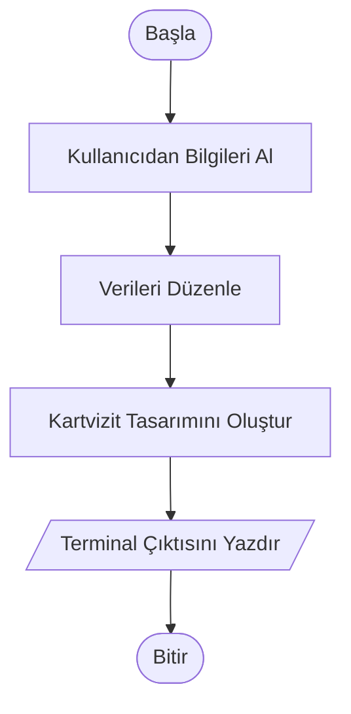

# Dijital Kartvizit Oluşturucu


## 📝 Proje Hakkında

Bu proje, kullanıcıdan alınan kişisel ve profesyonel bilgileri (isim, soyisim, unvan, iletişim) belirli bir formatta düzenleyerek şık ve okunaklı bir Dijital Kartvizit çıktısı verir. Temel amacı, kullanıcı etkileşimini yönetmek ve metin verilerini görsel bir düzen içinde sunmaktır.


## 🚀 Özellikler

* **Veri Temizleme:** Kullanıcıdan alınan boşluklu girdileri .strip() ile temizler.
* **Format Düzenleme:** İsimleri baş harfi büyük, soyisimleri ise tamamen büyük harf olacak şekilde otomatik formatlar.
* **Dinamik Hizalama:** Kartvizit başlığını belirlenen genişliğe göre otomatik olarak ortalar.
* **Kullanıcı Dostu Arayüz:** Terminal üzerinden etkileşimli veri girişi sağlar.


## 🔄 Akış Şeması (Flowchart)

Programın çalışma mantığı aşağıda gösterilmiştir:




## 🛠️ Kullanılan Teknolojiler

* **Python 3.12.6**
 

## 💻 Kurulum ve Kullanım

Bu projeyi yerel bilgisayarınızda çalıştırmak için aşağıdaki adımları sırasıyla takip edebilirsiniz:

I. Projeyi Bilgisayarınıza İndirin.

Öncelikle depoyu (repository) yerel makinenize klonlayın:

``` bash
git clone https://github.com/ShekhNebi/python-projects.git
```
II. Depo Klasörüne Giriş Yapın.

Terminal üzerinden indirdiğiniz dosyanın içine gidin:

``` bash
cd python-projects
```
III. Proje Klasörüne Giriş Yapın.

Depo klasörürnün içindeki proje klasörünün içine gidin:

``` bash
cd proje-001-dijital-kartvizit-oluşturucu
```
IV. Projeyi Çalıştırın

Ana uygulama dosyasını çalıştırın:

``` bash
python main.py
```


## 📞 İletişim

Projeyle ilgili geri bildirimleriniz için:
* **Geliştirici:** Ahmed Şeyhnebi
* **LinkedIn:** [Ahmed Seyhnebi](https://www.linkedin.com/in/ahmed-seyhnebi-828123252/)
* **E-posta:** [ahmedshekhnebi@gmail.com](mailto:ahmedshekhnebi@gmail.com)


## ⚖️ Lisans

Bu proje **MIT Lisansı** ile lisanslanmıştır. Bu, kodun ticari veya kişisel projelerde özgürce kullanılabileceği, kopyalanabileceği ve değiştirilebileceği anlamına gelir.

Daha fazla bilgi için [LICENSE](../LICENSE) dosyasına göz atabilirsiniz.