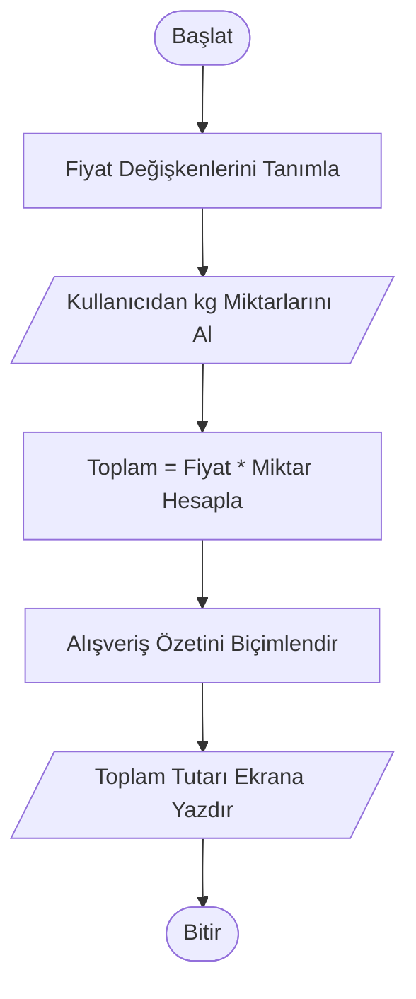

# Kasa Otomasyon Sistemi


## 📝 Proje Hakkında

Bu proje, bir manavdaki temel ürünlerin (domates, biber, patlıcan) kilogram bazlı fiyatlarını hesaplayan basit bir kasa otomasyon sistemidir. Projenin temel amacı, kullanıcıdan alınan miktar verilerini önceden tanımlanmış fiyatlarla çarparak toplam alışveriş tutarını düzenli bir özet şeklinde sunmaktır.


## 🚀 Özellikler

* **Dinamik Girdi:** Kullanıcıdan gerçek zamanlı miktar bilgisi alır.
* **Hassas Hesaplama:** float veri tipi sayesinde ondalıklı miktar girişlerine izin verir.
* **Biçimlendirilmiş Çıktı:** f-string kullanarak profesyonel ve hizalı bir alışveriş özeti tablosu oluşturur.
* **Hata Payı Düşük:** Toplam maliyeti kuruş hassasiyetiyle (iki ondalık basamak) gösterir.


## 📐 Algoritma ve Formüller

Sistem, toplam tutarı hesaplamak için şu genel formülü kullanır:

$$Toplam = \sum_{i=1}^{n} (F_{i} \times m_{i})$$

* **$n$**: Sepetteki toplam farklı ürün sayısını temsil eder.
* **$i$**: Her bir ürünü temsil eden indis numarasıdır.
* **$F_{i}$**: $i$. sıradaki ürünün birim fiyatıdır (TL/kg).
* **$m_{i}$**: $i$. sıradaki ürünün kullanıcı tarafından girilen miktarıdır (kg).


## 🔄 Akış Şeması (Flowchart)

Programın çalışma mantığı aşağıda gösterilmiştir:




## 🛠️ Kullanılan Teknolojiler

* **Python 3.12.6**
 

## 💻 Kurulum ve Kullanım

Bu projeyi yerel bilgisayarınızda çalıştırmak için aşağıdaki adımları sırasıyla takip edebilirsiniz:

I. Projeyi Bilgisayarınıza İndirin.

Öncelikle depoyu (repository) yerel makinenize klonlayın:

``` bash
git clone https://github.com/ShekhNebi/python-projects.git
```
II. Depo Klasörüne Giriş Yapın.

Terminal üzerinden indirdiğiniz dosyanın içine gidin:

``` bash
cd python-projects
```
III. Proje Klasörüne Giriş Yapın.

Depo klasörürnün içindeki proje klasörünün içine gidin:

``` bash
cd proje-002-kasa-otomosyon-sistemi
```
IV. Projeyi Çalıştırın

Ana uygulama dosyasını çalıştırın:

``` bash
python main.py
```


## 📞 İletişim

Projeyle ilgili geri bildirimleriniz için:
* **Geliştirici:** Ahmed Şeyhnebi
* **LinkedIn:** [Ahmed Seyhnebi](https://www.linkedin.com/in/ahmed-seyhnebi-828123252/)
* **E-posta:** [ahmedshekhnebi@gmail.com](mailto:ahmedshekhnebi@gmail.com)


## ⚖️ Lisans

Bu proje **MIT Lisansı** ile lisanslanmıştır. Bu, kodun ticari veya kişisel projelerde özgürce kullanılabileceği, kopyalanabileceği ve değiştirilebileceği anlamına gelir.

Daha fazla bilgi için [LICENSE](../LICENSE) dosyasına göz atabilirsiniz.