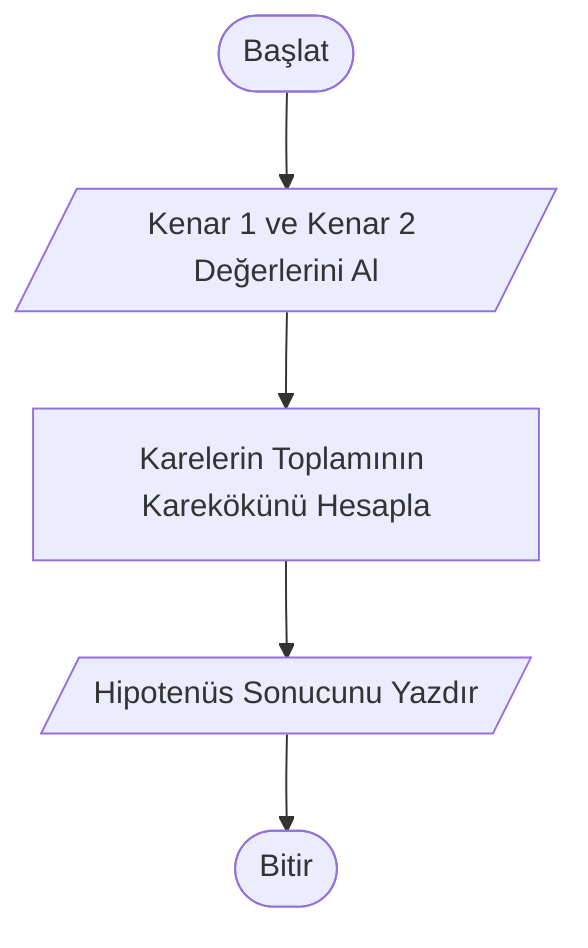

# Hipotenüs Hesaplayıcı


## 📝 Proje Hakkında

Bu proje, kullanıcının girdiği iki dik kenar uzunluğunu kullanarak bir dik üçgenin hipotenüs uzunluğunu hesaplayan basit ve etkili bir Python aracıdır. Geometrik hesaplamaları dijital ortama aktararak manuel işlem hatasını ortadan kaldırmayı amaçlar.


## 🚀 Özellikler

* **Kullanıcı Etkileşimi:** Kullanıcıdan dinamik olarak veri girişi alır.
* **Hassas Hesaplama:** float veri tipi sayesinde ondalıklı sayılarla işlem yapabilir.
* **Anlık Sonuç**: Hesaplama sonucunu temiz ve okunaklı bir formatta kullanıcıya sunar.


## 📐 Algoritma ve Formüller

Bu program temel Pisagor Teoremi'ni kullanır. Bir dik üçgende dik kenarların karelerinin toplamı, hipotenüsün karesine eşittir.

Kullanılan matematiksel formül:

$$c = \sqrt{a^2 + b^2}$$


## 🔄 Akış Şeması (Flowchart)

Programın çalışma mantığı aşağıda gösterilmiştir:




## 🛠️ Kullanılan Teknolojiler

* **Python 3.12.6**
 

## 💻 Kurulum ve Kullanım

Bu projeyi yerel bilgisayarınızda çalıştırmak için aşağıdaki adımları sırasıyla takip edebilirsiniz:

I. Projeyi Bilgisayarınıza İndirin.

Öncelikle depoyu (repository) yerel makinenize klonlayın:

``` bash
git clone https://github.com/ShekhNebi/python-projects.git
```
II. Depo Klasörüne Giriş Yapın.

Terminal üzerinden indirdiğiniz dosyanın içine gidin:

``` bash
cd python-projects
```
III. Proje Klasörüne Giriş Yapın.

Depo klasörürnün içindeki proje klasörünün içine gidin:

``` bash
cd proje-002-kasa-otomosyon-sistemi
```
IV. Projeyi Çalıştırın

Ana uygulama dosyasını çalıştırın:

``` bash
python main.py
```


## 📞 İletişim

Projeyle ilgili geri bildirimleriniz için:
* **Geliştirici:** Ahmed Şeyhnebi
* **LinkedIn:** [Ahmed Seyhnebi](https://www.linkedin.com/in/ahmed-seyhnebi-828123252/)
* **E-posta:** [ahmedshekhnebi@gmail.com](mailto:ahmedshekhnebi@gmail.com)


## ⚖️ Lisans

Bu proje **MIT Lisansı** ile lisanslanmıştır. Bu, kodun ticari veya kişisel projelerde özgürce kullanılabileceği, kopyalanabileceği ve değiştirilebileceği anlamına gelir.

Daha fazla bilgi için [LICENSE](../LICENSE) dosyasına göz atabilirsiniz.